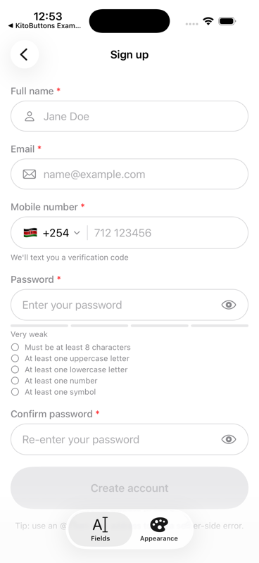
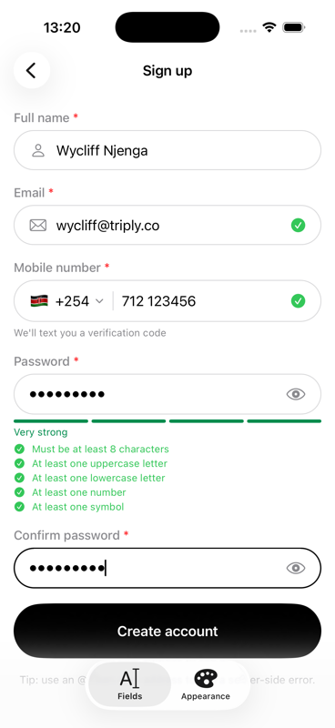
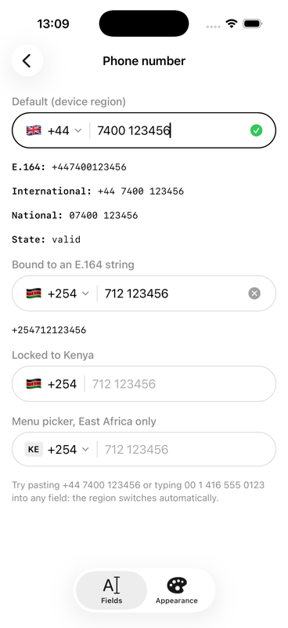
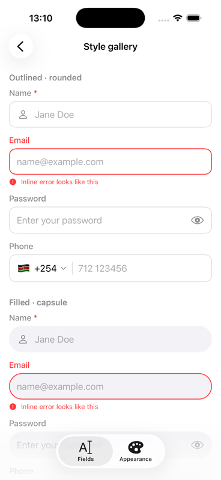
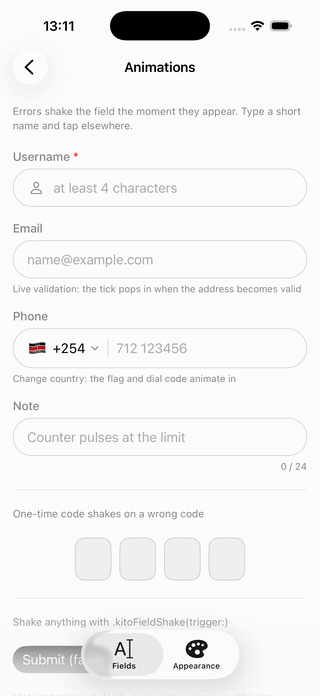
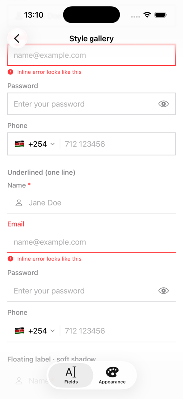
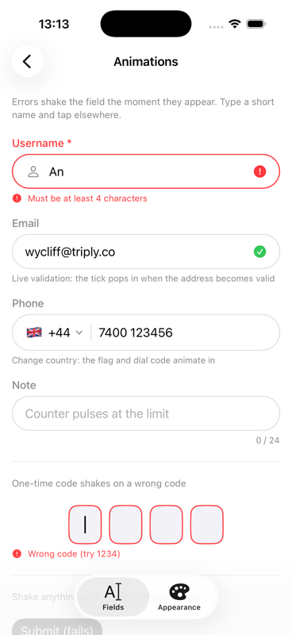

# KitoFields

Professional, fully customisable SwiftUI form inputs: text, email, password, phone number with country picker, and one-time code. One style and theme system drives every field, so a whole app can switch from rounded outlines to capsules or a single underline with one modifier.

- iOS 15+, macOS 12+, tvOS 15+, watchOS 8+, visionOS 1+; pure SwiftUI, no dependencies
- Author: **Wycliff Njenga**
- Licence: MIT

<p align="center">
  
  
  
  
</p>

<p align="center">
  
  
  
</p>

## Installation

### Swift Package Manager (recommended)

**In Xcode**

1. File ▸ Add Package Dependencies…
2. Paste `https://github.com/wykeenjenga/KitoFields.git`
3. Dependency rule: *Up to Next Major Version* from `1.4.0`
4. Add the `KitoFields` product to your app target

**In `Package.swift`**

```swift
dependencies: [
    .package(url: "https://github.com/wykeenjenga/KitoFields.git", from: "1.4.0")
],
targets: [
    .target(name: "MyApp", dependencies: ["KitoFields"])
]
```

### CocoaPods

```ruby
pod 'KitoFields', '~> 1.4'
```

Then `pod install` and open the `.xcworkspace`.

### Import

```swift
import KitoFields
```

### Requirements

| | Minimum |
| --- | --- |
| iOS | 15.0 |
| macOS | 12.0 |
| tvOS | 15.0 |
| watchOS | 8.0 |
| visionOS | 1.0 |
| Swift | 5.9 |
| Xcode | 15 |

Pair it with [KitoButtons](https://github.com/wykeenjenga/KitoButtons) for matching capsule buttons and add-to-cart animations.

## Fields at a glance

| Field | What you get |
| --- | --- |
| `KitoTextField` | General text input: title or no title, placeholder, leading/trailing accessories, clear button, character limit + counter, multiline, transforms, validation |
| `KitoEmailField` | Email keyboard and autofill, whitespace stripped, `.email` rule on blur |
| `KitoPasswordField` | Secure entry, reveal toggle, strength meter, live requirement checklist, confirm-password matching via `.mustMatch($password)` |
| `KitoPhoneField` | Country selector (sheet / menu / locked), flags, as-you-type formatting, `+`/`00` paste detection, E.164 output, 220+ regions |
| `KitoCountryField` | Country selector: flag (emoji, circle, rounded, tile, ISO badge), name, dial code and currency, with a searchable picker that remembers recent picks |
| `KitoNameField` | Words capitalization, letters-only rule, animated person icon, given/family autofill |
| `KitoUsernameField` | Lowercase, allowed-character rule, debounced async availability check with spinner and result |
| `KitoSearchField` | Magnifier, clear, debounced `onSearch` |
| `KitoURLField` | URL keyboard and validation |
| `KitoTextArea` | Multi-line with a remaining-characters counter |
| `KitoNumberField` / `KitoCurrencyField` | Locale-aware numbers, ranges, steppers, units, currency formatting from a code or a `KitoCountry` |
| `KitoDateField` | Masked date entry, real-date validation, min/max/future, calendar sheet |
| `KitoCardNumberField` / `KitoCardExpiryField` / `KitoCVVField` | Brand detection (Visa, Mastercard, Amex, Discover, Diners, JCB, UnionPay), brand-specific grouping, Luhn, MM/YY not-expired |
| `KitoSelectField` | Dropdown with searchable sheet or menu, subtitles and icons |
| `KitoCodeField` | OTP boxes backed by one hidden field so SMS autofill and paste work |

Every field conforms to `KitoFieldConfigurable`, so they share the same fluent modifiers.

## Quick start

```swift
import KitoFields

struct SignUp: View {
    @State private var name = ""
    @State private var email = ""
    @State private var phone: KitoPhoneNumber?
    @State private var password = ""
    @State private var formValid = false

    var body: some View {
        VStack(spacing: 18) {
            KitoTextField("Full name", text: $name, prompt: "Jane Doe")
                .leadingIcon("person")
                .required()
                .validation(.minLength(2))

            KitoEmailField(text: $email)
                .required()
                .validationIndicators()

            KitoPhoneField("Mobile number", phoneNumber: $phone)
                .required()
                .countries(preferred: ["KE", "UG", "TZ"])
                .helperText("We'll text you a verification code")

            KitoPasswordField(text: $password)
                .newPassword()
                .strengthMeter()
                .requirements(KitoRule.strongPassword())
        }
        .kitoFieldStyle(.outlined)
        .kitoFieldShape(.capsule)
    }
}
```

## Error presentation

```swift
.errorPresentation(.inline)               // text under the field (default)
.errorPresentation(.floating)             // bubble above the field; flips below when there is no room, never covers the input
.errorPresentation(.floatingWhenFocused)  // bubble only while editing
.errorPresentation(.none)                 // border and indicator only
.kitoFieldTheme { $0.errorPresentation = .floating; $0.errorBubbleBackground = .black }
```

## Animated icons

```swift
.leadingIcon("person", focused: "person.fill", motion: .bounce)     // .swap / .bounce / .wiggle / .pulse
.leadingIcon("envelope", focused: "envelope.open.fill", error: "envelope.badge", motion: .wiggle)
KitoPasswordField(text: $pw).animatedLockIcon()                       // lock fills, opens on reveal, wiggles on error
.leadingAccessory(.reactive { ctx in /* ctx.isFocused, hasError, isSuccess, isEmpty */ })
```

## Password meter and checklist

Everything about the strength meter and requirement checklist is configurable through `.passwordUI { }`:

```swift
KitoPasswordField(text: $password)
    .strengthMeter()
    .requirements(KitoRule.strictPassword() + [.notContaining({ email })])
    .passwordUI { ui in
        ui.checklistStyle = .chips            // .list / .grid / .chips / .compact / .hidden
        ui.meterStyle = .ring                 // .segments(4) / .bar / .ring / .dots(6) / .textOnly / .hidden
        ui.metSymbol = "checkmark.seal.fill"; ui.unmetSymbol = "seal"
        ui.metColor = .indigo; ui.strikesThroughMet = true
        ui.showsOnlyUnmet = true; ui.hidesChecklistWhenAllMet = true
        ui.showsProgressHeader = true         // "3 of 5 requirements met"
        ui.levelLabels[.veryStrong] = "Fort Knox"; ui.levelColors[.veryStrong] = .mint
        ui.order = .checklistThenMeter
        ui.scorer = { pw in pw.count > 12 ? .veryStrong : .fair }   // your own scoring
    }
```

Rule presets: `.strongPassword()`, `.strictPassword()`, `.notCommonPassword()`, `.noRepeatedCharacters(max:)`, `.noSequences(length:)`, `.notContaining({ email })`, plus every rule's `message:` parameter for custom or translated text.

## Shared modifiers (all fields)

```swift
.label("Title")                 // or omit for no title
.placeholder("Hint")
.helperText("Neutral hint under the field")
.errorMessage(serverError)      // inline error you control (e.g. from an API)
.required()                     // adds "*" to the label and a required rule
.required(false)                // shows the theme's optional indicator if set
.leadingIcon("envelope")        // or .leadingAccessory(.text("KES")) / .custom { AnyView }
.trailingAccessory(.button(systemImage: "info.circle", accessibilityLabel: "Info") { ... })
.clearButton()
.characterLimit(120, showsCounter: true)
.validation(.minLength(3), .alphanumeric(), trigger: .live)   // .live / .onBlur / .onSubmit / .never
.validationIndicators()         // ✓ / ! trailing icons
.keyboard(.decimalPad).contentType(.username).autocapitalization(.never).autocorrectionDisabled()
.multiline(3...6)
.transform { $0.lowercased() }
.focused($isNameFocused)        // Binding<Bool>
.focused($focus, equals: .name) // FocusState<Field?>.Binding, like SwiftUI's own modifier
.isValid($nameIsValid)          // continuously written, handy for enabling a submit button
.onValidationChange { state in } .onSubmit { } .onFocusChange { focused in }
```

### Validation rules

`KitoRule` presets: `.required`, `.email`, `.url()`, `.minLength(n)`, `.maxLength(n)`, `.exactLength(n)`, `.numeric()`, `.decimal()`, `.alphanumeric()`, `.containsUppercase()`, `.containsLowercase()`, `.containsDigit()`, `.containsSymbol()`, `.noWhitespace()`, `.regex(pattern, message:)`, `.matches({ other }, message:)`, `.custom(message:) { value in Bool }`, and the bundle `KitoRule.strongPassword()`.

Rules other than `.required` pass on empty input, so optional fields stay quiet until the user types.

### Validate a whole form

Wiring one `@State var xValid` per field and disabling a button is fine for two or three fields, but
gets old fast on a real sign-up screen. `KitoFormController` does that bookkeeping for you: register
each field once, then validate every field and jump to the first failure with a single call.

```swift
private enum Field: Hashable { case name, email, password }

@StateObject private var form = KitoFormController()
@FocusState private var focus: Field?

KitoTextField("Full name", text: $name)
    .required()
    .kitoFormField(Field.name, form: form, focus: $focus, equals: .name)

KitoEmailField(text: $email)
    .required()
    .kitoFormField(Field.email, form: form, focus: $focus, equals: .email)

KitoPasswordField(text: $password)
    .required()
    .requirements(.strongPassword())
    .kitoFormField(Field.password, form: form, focus: $focus, equals: .password)

Button("Create account") {
    guard form.validate() else { return }   // reveals every field's errors, focuses the first failure
    submit()
}
```

`form.validate()` never re-runs your validation rules; each field already reports its own validity
(the same thing `.isValid(_:)` reports), so `validate()` only reveals what the fields already know and
focuses the first one, in the order they appear on screen. `form.isValid` reads live without revealing
anything or moving focus (handy for disabling the submit button), and `form.reset()` clears recorded
invalidity for a fresh form. Works with any field that has an `.isValid(_:)`/`.focused(_:)` — text,
email, password, phone, select, country and the presets built on them.

If you'd rather not wire a `@FocusState` yourself, drop the `focus`/`equals` arguments and pass a plain
closure instead: `.kitoFormField(Field.name, form: form) { isNameFocused = true }`.

## Styles and shapes

```swift
.kitoFieldStyle(.outlined)       // default: border, transparent background
.kitoFieldStyle(.filled)         // solid fill, border only on focus/error
.kitoFieldStyle(.underlined)     // one line under the text
.kitoFieldStyle(.floatingLabel)  // label floats from placeholder position to the top
.kitoFieldStyle(.plain)          // no chrome

.kitoFieldShape(.capsule)        // .rectangle, .roundedRectangle(cornerRadius:), .capsule, .underline
```

### Theme tokens

```swift
.kitoFieldTheme { theme in
    theme.shape = .roundedRectangle(cornerRadius: 8)
    theme.showsBorder = false
    theme.filledBackgroundColor = .indigo.opacity(0.08)
    theme.focusedBorderColor = .indigo
    theme.errorColor = .pink
    theme.font = .system(.body, design: .rounded)
    theme.uiFont = .systemFont(ofSize: 17, weight: .regular)   // iOS only: font for the UIKit-backed phone input
    theme.requiredIndicator = "*"          // nil to hide
    theme.optionalIndicator = "(optional)" // nil to hide
    theme.errorDisplay = .all              // .first / .all / .none
    theme.errorIcon = "exclamationmark.circle" // nil hides it
    theme.errorFont = .system(size: 13); theme.errorIconFont = .system(size: 12)
    theme.shadow = KitoShadow()
}
```

Presets: `KitoFieldTheme.default`, `.soft`, `.capsule`, `.sharp`, `.underline`.

### Custom style

Implement `KitoFieldStyle` to control layout completely. The configuration hands you the label, placeholder, input, accessories, footer, error messages and state; reuse `KitoFieldRow`, `KitoFieldStack`, `KitoFieldMessages` and `.kitoFieldChrome(...)` or draw everything yourself.

```swift
struct CardFieldStyle: KitoFieldStyle {
    func makeBody(configuration c: Configuration) -> some View {
        KitoFieldStack(c) {
            KitoFieldRow(c)
                .kitoFieldChrome(c, fill: .white, borderWidth: c.isFocused ? 2 : 0)
        }
    }
}
```

## Motion

Every field animates focus, errors, success ticks, floating labels and flag swaps through
`KitoFieldTheme.motion` (`KitoFieldMotion`):

```swift
.kitoFieldTheme { $0.motion = .lively }        // spring focus, 2% lift, glow; .subtle disables the shake
.kitoFieldTheme { $0.motion.shakesOnError = false; $0.motion.focusScale = 1.03 }
```

- Fields shake horizontally the moment an error first appears (`shakesOnError`).
- `focusScale` and `focusedShadow` lift the focused field.
- Floating labels spring into place (`motion.label`); ticks, clear buttons, counters and flags pop (`motion.pop`).
- `KitoPhoneField` animates the flag and dial code when the country changes.
- `KitoCodeField` shakes when you set an error message.
- Shake any view yourself with `.kitoFieldShake(trigger:)`.
- When the system **Reduce Motion** setting is on, every field automatically switches to `KitoFieldMotion.subtle`: no shake, no lift, short fades. Custom styles get this for free by reading `configuration.motion` instead of `theme.motion`.

## Localization

Every built-in string (rule messages, picker titles, password strength labels, accessibility labels)
is localized. English, Swahili (`sw`) and French (`fr`) ship in the package; country names come from
the system for every language. To override or add languages, supply a provider once at launch:

```swift
KitoLocalization.provider = { key, english in
    NSLocalizedString("kito.\(key)", value: english, comment: "")   // return nil to keep the bundled copy
}
```

Per-field messages still win: `.required(message:)`, `.validation(.minLength(8, message: "…"))`,
`.phoneErrorMessages { … }` and `.countryPicker { $0.strings.title = "…" }`.

## Phone numbers

```swift
KitoPhoneField(phoneNumber: $phone)               // Binding<KitoPhoneNumber?>
KitoPhoneField(e164: $e164String)                 // "+254712123456" or ""
KitoPhoneField(country: $country, nationalNumber: $digits)

    .countries(allowed: ["KE", "UG"], excluded: [], preferred: ["KE"])
    .defaultCountry("KE")          // default is "US"; .defaultCountry(.deviceRegion) follows the device
    .countrySelection(.sheet)      // .menu / .locked
    .flagStyle(.emoji)             // .isoCode / .hidden
    .showsDialCode(true).showsChevron(true).showsDivider(true)
    .formatsAsYouType(true).limitsToMaxLength(true).detectsInternationalInput(true)
    .countryPicker { $0.strings.title = "Choose a country" }
    .phoneValidator(KitoPhoneValidator { number in number.nationalNumber.hasPrefix("7") ? nil : .custom("Mobile numbers only") })
    .phoneErrorMessages { error in localized(error) }
    .onPhoneNumberChange { number in } .onCountryChange { country in }
```

`KitoPhoneNumber` gives you `e164`, `international`, `national`, `formatted(.nationalWithTrunkPrefix)`, `rfc3966`, `url`, `isValid`, and is `Codable` as `{ isoCode, nationalNumber }`. Parse anything with `KitoPhoneNumber(parsing: "+44 7400 123456")` or `KitoPhoneNumber(e164:)`.

`KitoCountryDatabase` exposes all regions with flags, localized names, dial codes, formats and example numbers. Shared dial codes (+1, +7, +44, +61, …) are resolved by area or leading digits.

## Country field and country data

```swift
KitoCountryField("Country", selection: $country)          // Binding<KitoCountry?>
KitoCountryField("Country", isoCode: $isoCode)             // Binding<String>, "" when empty
    .shows(flag: true, name: true, dialCode: true, currency: true)
    .flagStyle(.circle)                                    // .emoji / .circle / .rounded / .tile / .isoCode / .hidden
    .countries(preferred: ["KE", "US", "GB"])
    .required()
    .onCountryChange { country in
        country.flag                 // 🇰🇪
        country.localizedName        // "Kenya"
        country.formattedDialCode    // "+254"
        country.currencyCode         // "KES"
        country.currencySymbol       // "KSh"
        country.formatCurrency(1250) // "KSh 1,250.00"
        country.summary              // flat struct with all of the above
    }
```

The phone field's `.onCountryChange` hands back the same `KitoCountry`, and `.flagStyle(.circle)` works there too.

### Country picker

Recent picks and Suggested countries appear as capsule chips (up to four each), followed by
Recent searches, Your region and A–Z sections. Search matches the localized name, English name, ISO code, dial code and currency code, ignoring
accents. The list shows **Recent** picks (persisted, per storage key), **Your region**, your
preferred countries and then A–Z sections. Configure with `.countryPicker { $0.showsRecents = false; $0.showsCurrency = true; $0.groupsAlphabetically = false }`.

## One-time code

```swift
KitoCodeField(code: $code, length: 6)
    .secure()
    .errorMessage(wrongCode ? "Incorrect code" : nil)
    .clearsOnError()             // shakes, then clears the boxes for you after a wrong code
    .onComplete { code in verify(code) }
    .boxSize(CGSize(width: 80, height: 90)).spacing(38)   // large boxes
    .showsCaret(false)                                    // focus shown by the border only
    .digitFont(.system(size: 28, weight: .semibold))
```

`.showsCaret(false)` hides the blinking bar in the active box (useful when a design shows focus
through the border alone) and `.digitFont(_:)` sets the font for entered digits.

Pair it with `KitoResendCodeButton` for the "Resend code" link underneath — it disables itself and
counts down on its own, so you don't need a timer in the screen that hosts the field:

```swift
KitoResendCodeButton(cooldown: 30) {
    resendCode()
}
```

## Example app

`Example/KitoFieldsExample.xcodeproj` (in this repository) demonstrates every field, style, shape, theme and motion preset: sign-up form, text field options, phone, password, one-time code, style gallery and an animations screen. Regenerate the project with `xcodegen generate` after editing `Example/project.yml`.

## Contributing

KitoFields is open source and open to contributions. The short version:

1. **Open an issue** describing the bug or the feature you would like.
2. **Fork and branch** from `main`, make the change with tests and a screenshot or GIF for UI work.
3. **Open a pull request** referencing the issue. CI runs the tests, the iOS example build and the podspec lint.
4. Once **approved**, a maintainer merges it and it ships in the next release.

See [CONTRIBUTING.md](CONTRIBUTING.md) for details, and the issue templates for what to include.

## Support the project

If KitoFields saved you time, you can buy me a coffee. It keeps the packages maintained and the example apps growing.

<a href="https://www.buymeacoffee.com/wycliffnjea"></a>

## License

MIT. See [LICENSE](LICENSE). Made by Wycliff Njenga in Nairobi.
